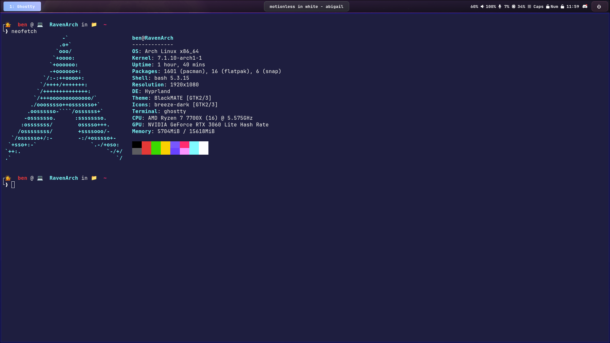
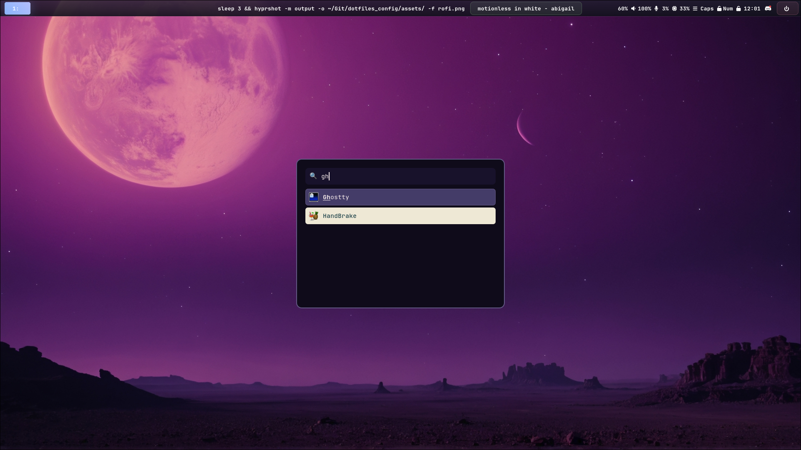

# 🏔️ Hyprland + NVIDIA Dotfiles

Welcome to my modular and highly aesthetic Arch Linux desktop environment configuration! This repository manages my window manager layouts, system package lists, and terminal settings cleanly using symbolic links.
---

## 🌌 Concept Presentation

I like to append a design concept to every project I have. This setup is called **RavenArch**, because I like ravens and it runs on Arch Linux. 

With this build, I wanted to see if a design combining **Ravens and space** could be viable—which is why you will see both themes featured in my wallpapers. As for the colors, I opted for a dark purple environment because I highly prefer to work at night and needed a scheme optimized for low-light productivity.

---
## 📸 Preview (My Setup Rice)




---

## 🖼️ Wallpapers

My system wallpapers are custom A.I. creations generated using tailored **KritaAI** prompts to match the RavenArch cosmic-cybernetic aesthetic. 

You can find the raw image files inside the **`assets/wallpapers/`** folder. Feel free to browse through them and apply whichever one fits your taste, or use your own custom backgrounds entirely!

---
## 🖥️ System Specs
* **OS:** Arch Linux (Deployed via `archinstall`)
* **CPU:** AMD Ryzen
* **GPU:** NVIDIA (Wayland Optimized)
* **WM:** Hyprland (Dark Purple Theme)
* **Terminal:** Ghostty

---

## 📂 Repository Structure
* `hypr/` - Hyprland window manager configurations (includes NVIDIA Wayland variables)
* `waybar/` - Custom status bar layout and matching purple CSS styling
* `rofi/` - Future-proof application launcher configs and layout assets
* `ghostty/` - Premium terminal configuration profiles and custom color palettes
* `pkglists/` - Text exports of official, AUR, Flatpak, and Snap packages
* `oh-my-bash/` - Simple guide to replicating my terminal prompt layout
* `scripts/` - Automated synchronization and installation utilities

---

## 🚀 How to Install / Deploy

### 1. Base Installation Tip
When installing Arch Linux using `archinstall`, ensure you select the **NVIDIA Proprietary Driver** option in the graphics profile menu. This ensures your kernel hooks (`mkinitcpio`) and bootloader parameters are generated automatically!

### 2. Clone the Repository
Once booted into your fresh Arch system, clone this tracking folder:
```bash
git clone https://github.com/BenLefe/dotfiles_config.git ~/Git/dotfiles_config
cd ~/Git/dotfiles_config
```

### 3. Link Your Interface
Run the deployment tool script to automatically tie the configuration folders from this repository directly to your system's local `~/.config/` profile via symbolic links:
```bash
chmod +x scripts/deploy.sh
./scripts/deploy.sh
```

### 4. Restore All System Packages
Ensure you have an AUR helper like `yay` compiled. Then execute these tracking streams to pull all applications back onto your environment:

```bash
# 1. Install Arch Official Packages
sudo pacman -S --needed - < pkglists/arch-repo.txt

# 2. Install AUR Packages
yay -S --needed - < pkglists/aur.txt

# 3. Install Flatpaks
xargs flatpak install -y < pkglists/flatpak.txt

# 4. Install Snaps
sudo systemctl enable --now snapd.socket
xargs -I {} sudo snap install {}
```

*(Note: For your terminal shell prompt theme, navigate into the `oh-my-bash/` folder and read the quick manual provided there.)*